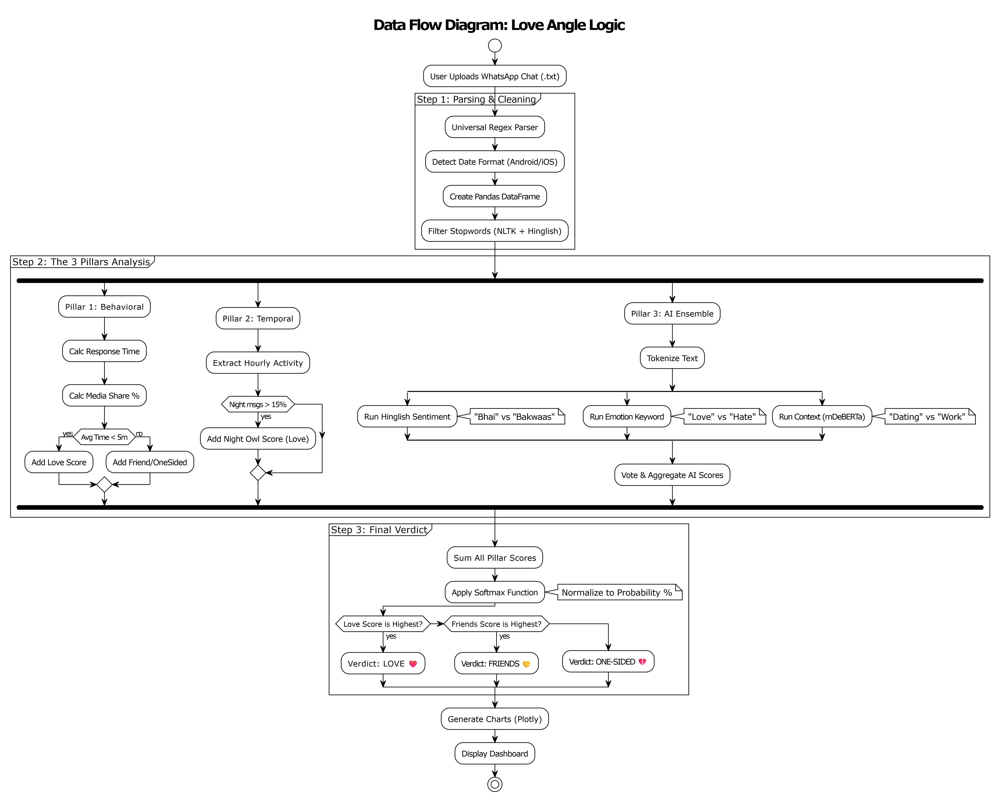

# Love Angle -

To develop a web application that analyzes WhatsApp chat exports using advanced Natural Language Processing (NLP) to classify relationships into "Love," "Friends," or "One-Sided" with high accuracy, specifically catering to Indian users (Hinglish)

## **System Architecture**

The system follows a **Streamlit-based Microservice Architecture** powered by a "Dream Team" of Hugging Face Transformers.

### **Tech Stack**

- **Frontend/UI:** Streamlit (Python)
- **Data Processing:** Pandas, NumPy, Regex
- **Natural Language Processing (NLP):**
    - Hugging Face `transformers`
    - `torch` (PyTorch)
    - `nltk` (Stopword Removal)
- **Visualization:** Plotly (Interactive Graphs), Advertools (Emoji Analysis)

## **The "Dream Team" AI Models (The Core Logic)**

This project uses an **Ensemble Learning Approach** (combining multiple models) to achieve "Human-Like" understanding.

| **Model Role** | **Model Name** | **Why It Was Chosen** |
| --- | --- | --- |
| **1. The Slang Specialist** | `rohanrajpal/bert-base-multilingual-codemixed-cased-sentiment` | **Purpose:** Sentiment Analysis.
**Strength:** Specifically trained on Indian social media. It understands slang like *"Bhai"* (Bro) and *"Bakwaas"* (Trash). It doesn't translate; it "reads" Hinglish directly. |
| **2. The Keyword Spotter** | `bhadresh-savani/distilbert-base-uncased-emotion` | **Purpose:** Emotion Detection.
**Strength:** Extremely fast at spotting universal emotional keywords in English (e.g., *"Love"*, *"Hate"*). Acts as a high-speed filter. |
| **3. The Brain (Context)** | `MoritzLaurer/mDeBERTa-v3-base-mnli-xnli` | **Purpose:** Zero-Shot Classification.
**Strength:** The most intelligent model. It is **Multilingual** (100+ languages) and understands **Context**. It determines if a text is about "Romance," "Fighting," or "Work" without needing training. |

### **The "4 Pillars" of Analysis**

The final verdict is calculated using a weighted algorithm across four distinct behavioral pillars.

### **Pillar 1: Responsiveness (Behavioral)**

**Logic:** Analyzes time gaps between messages.

**Scoring:**

◦ **< 5 mins avg:** High Priority (+Love)

◦ **> 5 hours avg:** Low Priority (+One-Sided)

**Media Ratio:** High photo/video sharing indicates comfort (+Friends/Love).

### **Pillar 2: The "Night Owl" Index (Temporal)**

**Logic:** Analyzes what time of day messages are sent.

**Scoring:**

◦ **Late Night (12 AM–4 AM):** Intimate/Personal (+Love)

◦ **Daytime Only:** Functional/Casual (+Friends)

### **Pillar 3: Sentiment & Emotion (The "Vibe")**

**Logic:** Uses the Ensemble AI to classify the chat's emotional temperature.

**Scoring:** High Positivity (+Love), Neutral (+Friends), Negative (+One-Sided).

### **Pillar 4: Deep Context (The "Meaning")**

**Logic:** The mDeBERTa model classifies conversations into seven real-life categories:

1. *Romantic Love & Passion* (+Love)
2. *Deep Care & Affection* (+Love)
3. *Playful Joking & Teasing* (+Friends) —> *Crucial for Indian friendships.*
4. *Casual Updates* (+Friends)
5. *Sadness & Heartbreak* (+One-Sided)
6. *Anger & Conflict* (+One-Sided)
7. *Professional Work* (−Love) —> *Filters out office chats.*

## **5. Features & Visualization**

**Universal Parser:** Auto-detects Android (12hr/24hr) and iOS date formats.

**Timeline Analysis:** Interactive line charts show message frequency (detects ghosting).

**Emoji Decoder:** Uses `advertools` to extract and rank top emojis.

**Smart Word Cloud:** Filters out English and Hinglish stopwords (e.g., "the," "hai," "mein") to reveal unique conversation topics.

### Dataflow Diagram

